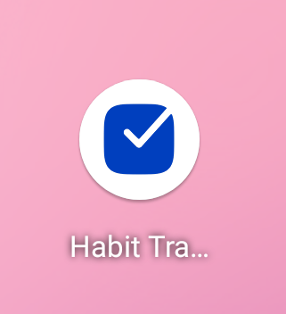
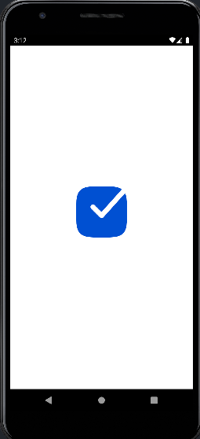
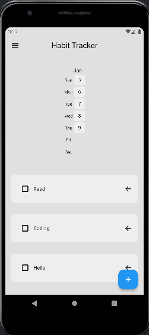
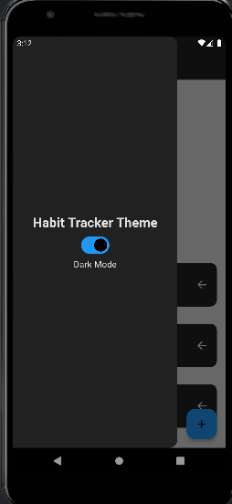
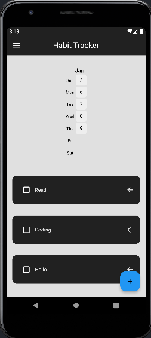
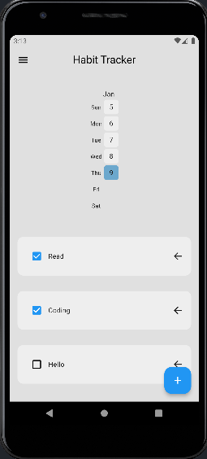

# habit_tracker_hive

**Habit Tracker App**:

---

# Habit Tracker App

A Flutter-based application designed to help users track and visualize their daily habits
effectively. With this app, users can build good habits, break bad ones, and monitor their progress
over time with a visually appealing heatmap.

## Features

- **Add, Edit, and Delete Habits**: Seamlessly manage your habits in an intuitive interface.
- **Mark Habits as Completed**: Easily track your progress with a single tap.
- **Monthly Heatmap Summary**: Visualize your habit completion trends over time.
- **Light and Dark Themes**: Toggle between themes to suit your preference.

## Screenshots

## Screenshots

## Screenshots

|  |  |  |
|:--------------------------------------------:|:--------------------------------------------:|:--------------------------------------------:|
|                 Screenshot 1                 |                 Screenshot 2                 |                 Screenshot 3                 |

|  |  |  |
|:--------------------------------------------:|:--------------------------------------------:|:--------------------------------------------:|
|                 Screenshot 4                 |                 Screenshot 5                 |                 Screenshot 6                 |

## Demo Video


## Installation

To run this project on your local machine:

1. Clone the repository:
   ```bash  
   git clone https://github.com/OmarZen/habit-tracker.git  
   ```  

2. Navigate to the project directory:
   ```bash  
   cd habit-tracker  
   ```  

3. Install dependencies:
   ```bash  
   flutter pub get  
   ```  

4. Run the app on an emulator or connected device:
   ```bash  
   flutter run  
   ```  

## Packages Used

- **flutter**: The core Flutter framework for building the app.
- **cupertino_icons**: Provides iOS style icons.
- **flutter_slidable**: Adds sliding actions to list items.
- **hive** & **hive_flutter**: A lightweight and fast key-value database.
- **flutter_heatmap_calendar**: Displays habit trends with heatmap visuals.
- **flutter_native_splash**: Customizes the native splash screen for the app.
- **provider**: A state management solution for Flutter apps.
- **hive_generator** & **build_runner**: For Hive adapter code generation.
- **flutter_lints**: Ensures good coding practices.

## How It Works

1. **Create a Habit**: Add a new habit by providing a name.
2. **Mark Completion**: Tap on a habit to mark it as completed for the day.
3. **Monitor Progress**: Check the monthly heatmap to see your habit consistency.

## Future Improvements

- Add reminders and notifications for incomplete habits.
- Enable syncing habits across devices using cloud storage.
- Add more advanced analytics for habit tracking.

## Contribution

Contributions are welcome! If you'd like to improve this project:

1. Fork the repository.
2. Create a new branch (`feature/your-feature-name`).
3. Commit your changes.
4. Open a pull request.

## License

This project is licensed under the MIT License - see the [LICENSE](LICENSE) file for details.

## Contact

Feel free to reach out if you have any questions or suggestions!

- **Author**: Omar Walid
- **Email**: [omarwaleedzenhom2002@gmail.com]
- **Telegram**: [t.me/OmarZenhom](https://t.me/OmarZenhom)
